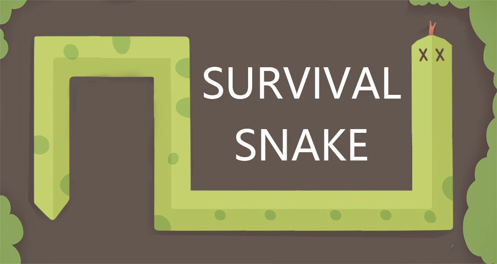
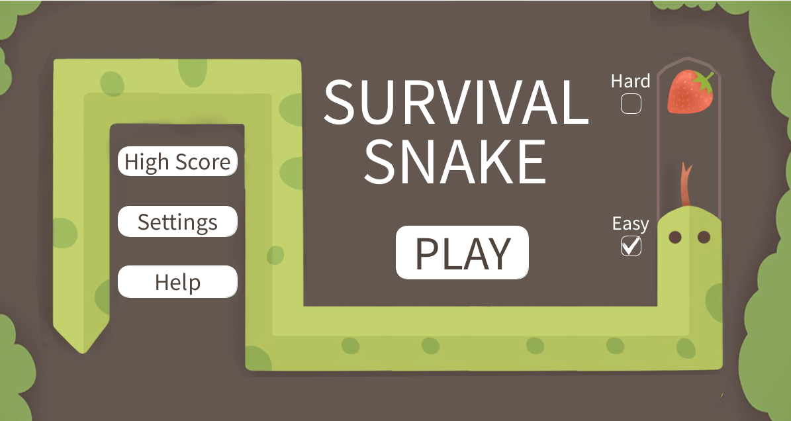

  

  <b><a href="https://youtu.be/I3r15m0HU9E">Click here or the image above to watch the DEMO VIDEO</a></b>

# Table of Contents
- [1. Team](#1-team)
- [2. Introduction](#2-introduction)
- [3. Requirements](#3-requirements)
- [4. Design](#4-design)
- [5. Implementation](#5-implementation)
- [6. Evaluation](#6-evaluation)
- [7. Process](#7-process)
- [8. Conclusion](#8-conclusion)
- [9. Acknowledgements](#9-acknowledgements)
- [10. Installation](#9-installation)

# 1. Team

    
    
<em>The team</em>

 
| Name             | Role                           | Email                                                 | GitHub Account                                            |
|------------------|--------------------------------|-------------------------------------------------------|-----------------------------------------------------------|
| Chris Kerr       | Project Manager / Developer    | [th23780@bristol.ac.uk](mailto:th23780@bristol.ac.uk) | [@chriskerrc](https://github.com/chriskerrc)              |
| Alexander Fisher | Lead Developer                 | [af17918@bristol.ac.uk](mailto:af17918@bristol.ac.uk) | [@alexandermfisher](https://github.com/alexandermfisher)  |
| Florence Rose    | Map Designer / Tester          | [xd23758@bristol.ac.uk](mailto:xd23758@bristol.ac.uk) | [@frose2024](https://github.com/frose2024)                |
| Josh Wierszycki  | Gameplay Developer             | [el20063@bristol.ac.uk](mailto:el20063@bristol.ac.uk) | [@JWierszycki](https://github.com/JWierszycki)            |
| Ziyuan Lu        | UI Developer                   | [py23518@bristol.ac.uk](mailto:py23518@bristol.ac.uk) | [@LzYzL](https://github.com/LzYzL)                        |
| Jie Fang         | UI Developer                   | [yh23030@bristol.ac.uk](mailto:yh23030@bristol.ac.uk) | [@Jiebristol](https://github.com/Jiebristol)              |

# 2. Introduction 
Our game is a take on the classic Nokia "Snake" game called "Survival Snake". The overarching principle remains the same: the player's goal is to grow their snake in length by consuming food that appears on the map, while also avoiding collisions with the snake itself or the map's borders. However, our game expands on these principles by incorporating elements of the first-person shooter genre into our game. 

The player snake has a finite "Venom" ability that allows you to destroy walls, collect food to grow your snake and kill the enemy snakes that spawn into the game. The enemy snakes track the player snake around the map and will kill the player snake, thus ending the game if the enemies manage to catch it. 

Another element we've added to Survival Snake is the creation of custom maps. We have designed four possible maps, two for each difficulty mode. Each map has unique wall placements. In all the maps, the player has the ability to 'wrap around', exiting one side of the map to re-appear on the other side, thereby adding another layer to the player snake's movement possibilities. 

 

    
    
<em>Survival Snake, Main Page</em>

# 3. Requirements

Refer to our [Requirements document](/docs/report/requirements.md) to see our:
- Initial Paper Prototyping
- Stakeholders
- User Stories
- Use-Case Diagram
- User-Case Specification

# 4. Design

Refer to our [Design document](/docs/report/design.md) to see our:
- System Architecture
- Class Diagram
- Behavioural Diagram

# 5. Implementation

Refer to our [Implementation document](/docs/report/implementation.md) to see our:
- Challenge 1 - Enemy Snake Pathfinding
- Challenge 2 - Venom Mechanic
- Challenge 3 - High Score Tracker

# 6. Evaluation

Refer to our [Evaluation document](/docs/report/evaluation.md) to see our:
- Qualitative Analysis
- Heuristic Analysis
- Quantitative Analysis

# 7. Process

Refer to our [Process document](/docs/report/process.md) to see an overview of our development process:

# 8. Conclusion 

Reflecting on the completion of "Survival Snake," it becomes clear that this project was not just a lesson in game development but also in collaborative problem-solving, adaptive learning, and strategic planning. The journey from concept to execution taught us invaluable lessons about the complexities of creating a game that balances traditional mechanics with innovative features.

One of the primary lessons learned was the importance of modular design and object-oriented principles. By utilizing a grid-based structure and abstracting game elements into discrete, manageable classes, we were able to maintain clean, maintainable code, which facilitated easier debugging and expansion. This architectural choice proved critical when integrating new features, such as the venom mechanic and enemy snakes, which introduced complex interactions within the game environment.

Collaboration was another important area of growth for our team. Using tools like WhatsApp for communication and GitHub for version control enabled us to streamline our workflow and maintain a continuous exchange of ideas. The adoption of a stand-up meeting format helped keep the team aligned on goals and milestones. Face-to-face interactions, whether physical or via video calls, were great for resolving the more complex issues that arose.

The introduction of first-person shooter elements into a classic snake game required careful consideration of game balance and player engagement. Ensuring that the venom ability was powerful enough to feel rewarding, yet not so dominant as to overshadow other game mechanics, required many iterations and playtesting sessions. The pathfinding of our enemy snakes also presented a significant challenge, necessitating a hierarchical movement system to prevent gameplay disruptions and maintain a logical flow. These obstacles tested our technical skills and also our ability to work as a team to find creative solutions.

Looking forward, there are several avenues for further development of "Survival Snake". We plan to add multiplayer functionality, allowing players to compete or cooperate in real-time. We would also like to add different types of walls, such as exploding walls that damage the player and portal walls that transport the player across the map. We aim to implement a "Survival Snake" shop where users could buy different themes for the game and skins for their snake. This would allow us to follow through on the red-green colour blindness change that one of our participants suggested.

### Individual Contributions 

| Name             | Contribution | 
|------------------|--------------|
| Chris Kerr       | 1            | 
| Florence Rose    | 1            | 
| Josh Wierszycki  | 1            | 
| Ziyuan Lu        | 1            | 
| Alexander Fisher | 1            | 
| Jie Fang         | 1            | 

# 9. Acknowledgements

- [Background music](https://sc.chinaz.com/yinxiao/161022106840.htm)
- [Button click music](https://www.aigei.com/sound/ui/button_3/)
- [Player snake death music](https://mixkit.co/free-sound-effects/game-over/)

# 10. Installation

1. Download Processing from the following link: [download here](https://processing.org/download).
      This downloads the graphical library and Integrated Development Environment (IDE) that the game runs on.

1. Download and extract the following ZIP file: [game_download_file](https://github.com/UoB-COMSM0110/2024-group-3/raw/develop/download/game_download_file.zip)
1. Run Processing and then open the game by clicking: **File -> Open -> {root_dir}/src/snakeGame/main.pde** 
       
   >    ##### *__note__: replace 'root_dir' with the actual filepath/location of the extracted root directory*
   
1. Install the following libraries by clicking **Tools -> Import Libra... -> Manage Libraries...**
 
   ##### &emsp;**Sound** | Provides a simple way to work with audio (Author: The Processing Foundation) [^1]

1. To run the game, click the **Play** button located to the top-left of the IDE window.

[^1]: Follow the link for more information on the [Sound Library](https://processing.org/reference/libraries/sound/index.html). 
