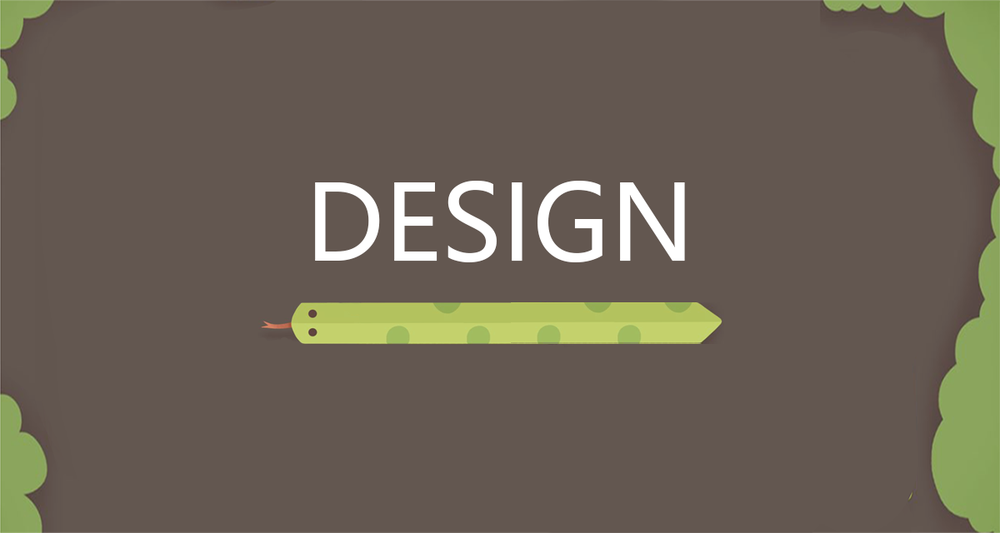

<div align="center">
    
</div>
<br>

[To do: introduce design section]

--- 

# Table of Contents
- [System Architecture](#system-architecture)
- [Class Diagram](#class-diagram)
- [Behavioural Diagrams](#behavioural-diagrams)


## System Architecture 

Our game in Processing is built upon a modular architecture that facilitates flexibility, extensibility and interpretability. The key design choice behind the entire architecture of the game was creating a grid of cells which are accessible by coordinates (x,y) and is implemented by the GridCell class. Below is an overview of the mapping of grid coordinates to the window. 

<blockquote> Grid is 45 rows by 100 cols where each cell has an index of (x, y) with the following mapping:
     
(0,0) --> top left

(99, 0) --> top right

(44, 0) --> bottom left

(99, 44) --> bottom right </blockquote>

This design choice matches the key idea and mechanism of the orginal snake game. The abstraction that the gridCell class provides in terms of not having to manage indivdual objects dimentions and mapping to window underpins the development of all the components/objects in the game. All objects present in the game are formed as an aggregation of 1 or more gridCells. This architecture enabled static objects including walls, and a variety of consumables including foor and venom-powerups to be made. In addition it enabled for a relatively trivial manner of introducing the dynamics to the gameplay, which pertains to the snake classes and venom.

## Entry Point and Control Flow

The core system architecture of Processing apps revolve around the setup() and draw() methods, which control the temporal sequence of method calls. Main.pde is the entry point to the game and is the root controller. Complimenting this structure and enabling the main control flow to be observable from Main.pde the main gameplay conroller 'GameScreen' has methods setup() and update() which are then called in Main.pde. This structuring redcuced the size of Main.pde and increased interpretability. GameScreen thus handles the update logic for the objects it manages however the control is handed back to Main.pde via the need of one method call GameScreen.update(). 

## Modularity and Object-Oriented Design

Our game is structured in a typical object-oriented fashion with separate classes used to define each of the game enitites. In addition approriate use of abstract classes have resulted in 'DRY' code that is more interpretable, maintaninable, and flexible. The modularity is evident and represented particularly well in the [class diagram](#final-class-diagram) with the use of containers which wrap around related classes. Below is a brief outline of some key classes which form the main object/entites in the game. 


## Breakdown of Selected Classes

### Wall

Walls are implemented as an aggregation of walls cells (aka. bricks). This idea is imlpemented as an array of WallCells where a WallCell inherits from GridCell. A stripped version of the Wall class is shown below to demonstrate the implementation. It can also be seen there are addWallCell and removeWallCell methods. This naturally allows the construction of walls as well as the removal of specific 'bricks' during gameplay without completely destroying the entire wall/object hence providing flexibility.  

```
public class Wall {
    private ArrayList<WallCell> wallCells;
    private int colour;
  
    public Wall(int colour) {}
    
    public void addWallCell(int x, int y) {}
    
    public void removeWallCell(PVector location) {}
    
    public void renderWall() {}
}
```


### Consumables

Consumables are implemented, again, as an aggregation of 1 or more grid cells. The current version of the game includes two subclasses **Food** and **Powerup**. These are still abstract and are realised in concrete implementations **Melon**, **Banana**, **Apple**, and **VenomRefiller**. This layered abstraction beggining at GridCell has been advantagous in incremental development due to the independence of objects. In addition the structures and architecture is in place to allow for the quick development of new features that can inherit large parts of existing code and mechanisms thus reducing the code required to add new additional features. If for example an additional powerup were to be added, it would 'piggy back' of the existing structures by directly inheriting from PowerUp.

### Abstract Snake

The abstract class is the parent class for the snakes in the game. It is similar to the previously discussed classes in the manner that a snake is an aggregation of SnakeCells (again which are a child of GridCell). To introduce the dynamic mechanic following on from this is natural and involvers removing one cell and adding another (assuming the snake hasn't eaten food and in a state of growth). The natural data structure for this behaviour is a linked list where SnakeCells are added to one end and removed from the other. This data structure can be seen in the code snippet below. 

```
abstract class AbstractSnake {
      protected LinkedList<SnakeCell> snakeCells;
      protected PVector velocity;
      protected int colour;
      protected GameScreen game;
    
      public AbstractSnake(GameScreen game, int colour) {
        this.snakeCells = new LinkedList<>();
        this.velocity = new PVector(0, -1); 
        this.colour = colour;
        this.game = game;
      }
}
```

## Overview of Collision Detection

The objects discussed above form the entities in the game, but they alone do not implement any dynamics or create a playable game. To bring the components together, a 'controller' class has been implemented, namely, GameScreen. GameScreen combines and utilizes these objects in a meaningful way to create gameplay by managing interactions, updates, and rendering of game entities. This class instantiates all available entities in the game via setup and constructor methods and then manages the update of game state between each frame in its update method. Below is a snippet from GameScreen which highlights the entities that form the game and that are managed by GameScreen.

```
private Object[][] mapGridObjectData;
      
//inanimate objects
private ArrayList<Wall> walls;
private Apple apple;
private Banana banana;
private Melon melon;
private VenomRefiller venomRefillerTwo;

//dynamic objects:
private Snake snake;
private ArrayList<EnemySnake> enemySnakes;
private ArrayList<Venom> venom;

```
A key attribute in this class pertinent to collision detection is mapGridObjectData. This is a 2D array of object references which encapsulates the current state of the game. Each iteration of the game, dynamic objects are mapped to their new grid locations. This provides an efficient lookup to determine which object occupies a specific grid, forming the first step of managing object interaction and collision detections. For example, if the player's snake moves into a wall, this collision is detected, and the game will end. Alternatively, if the snake moves into a grid cell containing a consumable, the appropriate action will be taken to increase body length, score, or venom available, and the game would continue. A key component of enabling each grid to be tracked but still having objects interact with others as a whole is the aggregation of cells to make the objects. This ultimately means that if an object is an aggregation of multiple cells, then each cell references the same object. This ensures that if an enemy snake is killed by the venom, the whole enemy snake dies and not just the first cell or the cell where the collision was detected.

To illustrate this design/implementation of collision detection, a snippet of code from the Snake class is shown below. Note the conditionals which check for the presence of an object in its new head location. If the gridCell contains a Wall or the Snake itself, then the gameState is over in accordance with the rules of the game. The consumables food and powerup are also handled. 

```
// gets curerent object that occupies where the new snake head position will be
// if cell is empty null will be returned indicating no collision

Object gridObject = game.getMapGridObjectData(headPosition);

if (gridObject instanceof Wall || gridObject instanceof Snake && !isSnakeCellWithinFirstThree(headPosition)) {
    gameState = GameState.OVER;
    return;
}

SnakeCell newHead = new SnakeCell(headPosition, colour);
snakeCells.add(newHead);
game.setMapGridObjectData(headPosition, this);

if (gridObject instanceof Food ) {
    // when snake eats food, move the food
    // add new head but dont remove tail: snake grows when it eats
}

if (hasVenomHitFood == true) {
    // return early to add new head but not remove tail: snake grows when it eats (via venom)
}

if (gridObject instanceof Powerup) {
    //move the powerup
    //replenish venom
    // add new head and remove tail: snake doesn't grow
}

```
<br>

---

### Class Diagram

This class diagram was created before we implemented the game, as part of the design process:

<div align="center">
    
    <p><em>Early class diagram</em></p>
</div>

This class diagram was created once the game was complete, and shows the final game design: 

<div id=final-class-diagram align="center">
    
    <p><em>Final Class Diagram</em></p>
</div>

Compare and contrast...

---

### Behavioural diagrams 

[Add text introducing the sequence diagram]

<div align="center">
    
    <p><em>Sequence diagram</em></p>
</div>

