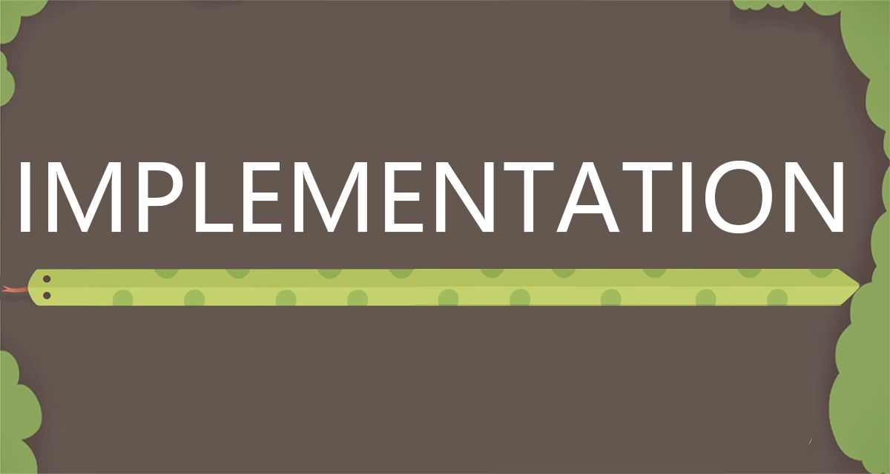

    

# 5. Implementation
During our game's implementation there were some features that we definitely wanted to include in our game. From these we identified three specific challenges; the enemy snake pathfinding, the venom mechanic and the highscore tracker.  

# Table of Contents
- [Challenge 1 - Enemy Snake Pathfinding](#challenge-1---enemy-snake-pathfinding)
- [Challenge 2 - Venom Mechanic](#challenge-2---venom-mechanic)
- [Challenge 3 - High Score Tracker](#challenge-3---high-score-tracker)

---

### Challenge 1 - Enemy Snake Pathfinding
We knew from the start that we needed the enemy snakes (ESs) to pose a real challenge to the player. This meant creating ESs that responded to in-game obstacles, tracked the player snake around the map and moved towards the player snake in a way that felt logical and intuitive to the player. The ESs use pathfinding to track the player snake around the map by finding the grid cell that reduces the distance to the player snake (the closest part of it's body) the most.

Originally the ESs weren't a part of the map grid that we track our game's objects on (walls, food, venom etc.), and this made managing the interactions of the ESs with our game's objects really tricky. As a consequence we tweaked the ES implemention to make use of the framework Alex created for the game grid, allowing us to impose limitations on the ESs movements so they couldn't move through walls, food, their own bodies or one another. This second attempt led to problems as well, causing the ESs to freeze in place when they had no square to occupy.

To solve this Josh implemented a hierarchical system of movement. This ensures the ESs find the best path to the player snake while minimising gameplay disruption as much as possible. The highest priority is to prevent the ESs from moving through walls because doing so would fundamentally alter the gameplay, so this rule is non-negotiable. The next priority is to prevent them from moving through themselves or one another. This is crucial for maintaining visibility and predictability in the game, as the player needs to see and predict the movements of enemy snakes to strategize their own. If no other free cells are available then the most acceptable move for the ESs to make is by traversing food/consumable-occupied cells since this wouldn't disrupt gameplay hugely, as the player can still interact with consumables using their venom. 

The hierarchy was designed so that the ESs would always prioritize the cell type over the distance to the player snake.

    
    
<em>ES Pathfinding</em>

---
   
### Challenge 2 - Venom Mechanic
The venom mechanic was one of the foundational parts of our game. The greatest challenges were with edge cases dealing with the borders of the map and walls. Our evaluation process was helpful here, as we found that the increased play time by a lot of different users was great at identifiying bugs and potential issues. 

The venom mechanic's functionality was written primarily via the `Venom` class. This class is responsible for modelling the venom projectile that the snake uses to interact with the environment and to target enemies. Initally, venom was only going to be used offensively, but during development we decided that it would be more fun for the player if venom could be used to collect food and destroy walls too. The `Venom` class makes use of a PVector to determine the venom's direction and velocity. Its starting position is determined by the location of the player snake's head. This information is handled by the class' constructor, which creates the initial set of venom cells and positions them in the game grid. We created a `handleCollusion(PVector position)` method that manages the effects when venom collides with other game objects like walls or enemy snakes, and an `updateGridData()` method that updates the game grid to reflect the current position of venom cells.

    
    
<em>Venom Mechanic</em>

---

### Challenge 3 - High Score Tracker
The high score tracker was added via a `ScoreData` class and a `HighScore` class. The `ScoreData` class is a simple data structure that holds the player's score and name. At runtime, the constructor of this class initialises this data with the values provided by the user when they saved their score at the end of earlier instances of the game. 

The `HighScore` class is designed to manage a list of the top scores in the form of a .csv file in the Map folder. An array stores the saved high scores, and a constructor reads the scores saved in the .csv file. Then, the `compare` method takes the given values from the 'ScoreData' class and compares them against the scores already saved in the array. This is iterated over until all the array's cells are checked. If the method finds an instance where the `ScoreData` value is greater than the value saved in the array it replaces it. At this point, the updated list of scores is written back to the .csv file.

Initially, we had only one list of high scores for the game, but after user feedback, we decided to create two separate lists for each difficulty mode. We thought this made the high scores more of a goal for the player. We included the high score in the menu bar of the game as well to provide an incentive for the player to beat it. 

    
    
    
<em>High Score Trackers for Both Difficulties</em>

As our game developed we continously checked for bugs and added new features. The UI artwork was created in photoshop by Jie and Ziyuan, who created the game's overall aesthetic and menu functionality. Our tutuorial page was originally only reachable via a `Help` button on the main menu.  After some user feedback, we decided to create a pop up tutorial page that launches when the game started. The player can navigate away from it by pressing any key. This increased the visibility of the game's help information without interrupting the flow of starting and playing the game. 

    
    
<em>Tutorial Pop Up Page</em>

 
