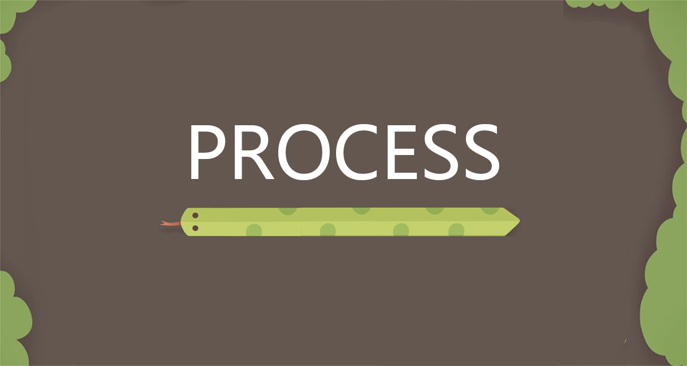

    

# 7. Process
As a group, we've come away from this project feeling satisfied and proud of our team's communication and cohesiveness. 

We made a group chat using WhatsApp during the first week of this term, and it has proven invaluable for organising our time and sharing ideas. Being able to share media with one another, discuss feedback and identify goals via a platform that allows virtually instantaneous communication has been essential. However, face-to-face meetings were also integral. Our lab sessions on Monday were very helpful for this, partially in how they facilitated discussion with other groups, but also in the opportunity they provided to plan one or two other face-to-face meetings each week. In these meetings we adopted a Scrum/stand-up style approach, with Alex often taking the role of the Scrum Leader. We discussed together how our personal areas of code were progressing, and if there were any features we wanted to suggest exploring. Depending on our respective schedules we'd then try to work on our respective parts of the code together in the labs. This was helpful because it meant we could show one another the areas of challenging/interesting code in person, as it can be somewhat tricky to discuss coding issues without being able to see the code in question. On a few occasions we took advantage of Teams' video call feature to meet face-to-face virtually if a team member was unable to make it to the labs that day. 

An initial snag we did encounter in our project was the transition from using IntelliJ and Java rather than the Processing IDE. In the beginning we thought that IntelliJ's increased functionality, specifically in areas such as code quality and testing, would prove it to be advantageous over Processing. However, after discussion with other groups and our module leads our group concluded that Processing would better serve the game's development. Fortunately, we weren't too far along in our code's lifespan when we made this decision, so the actual amount of code we had to translate from one environment to another wasn't too arduous. The aesthetic and user interface for our game was created through a combination of Photoshop and Processing, a task which Ziyuan headed up. 

As a whole, we found using GitHub to be relatively straightforward. Our team encountered some instances of merge conflicts that we had to solve, but an early decision to split our repository into two branches - Main and Develop - allowed us to stagger the rate at which code was pushed to our Main branch. Uncompleted/potentially buggy features would be limited to the Develop branch, ensuring that the Main branch stayed free of broken or uncompleted code. GitHub did provide us with an integral part of our development process, namely the Kanban Board. We found our Kanban Board to be incredibly helpful because it functioned as simultaneously an accessible to-do list, planning tool, and way to dispense the workload. Chris fulfilled the role of project manager in this department, adding tasks to the Kanban Board and assigning them to members of the team as needed.

    
    
<em>Our Kanban Board</em>

Our team also created a Git Convention documentation that detailed the acceptable way for our commits to be structured. It required that our commits be formatted __"[type]:[title] [body] [footer]__ . This encouraged us to be specific with our commit messages, ensuring that the relevant information on what the new/altered code did was contained within the message itself. The use of a <type> system was particularly helpful in categorising our commits, ensuring that our repo has a very coherent and simple commit history that can understood and searched through with ease. 

The map creating software that Alex wrote for our game was also indispensible. Using Processing, Alex created a piece of code that allows users to create and save maps for our game in a .csv format. The user draws maps onto the canvas using the mouse, and increments the map counter for each wall they create. Once their map is created it can be named and saved, with the .csv suffix added automatically by the program. We store the created maps in a relevant folder in our game code, and they can subsequently loaded into the game quickly, with in-game walls being placed in the same locations as chosen during the map creation process. This allowed us to create unique maps efficiently, helping us to differentiate between the easy and difficult modes of our game in a way that the player can immediately appreciate. 

    
    
<em>Processing Program to Create Maps</em>

    
    
<em>Map Folder Screenshot</em>

