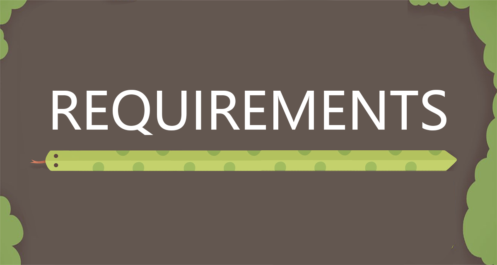

    

 

# 3. Requirements
In this section we will to describe the ideation process for our game. We will explain factors that we considered during our game's inception, and how these factors influenced the development process. We started with paper prototyping, and then we created user stories and use case diagrams. We also determined the basic and alternate flows that we wanted our game to have. 

# Table of Contents
- [Initial Paper Prototyping](#initial-paper-prototyping)
- [Stakeholders](#stakeholders)
- [User Stories](#user-stories)
- [Use-Case Diagram](#use-case-diagram)
- [Use-Case Specification](#use-case-specification)

---

### Initial Paper Prototyping
When we first got together we brainstormed two possible initial ideas: an 'Endless Runner' game or a 'Survival Game'. In our first session we managed to successfully create paper prototypes for both of these ideas : 

**Game Idea 1 : Endless Runner**
 

**Game Idea 2 : Survival Game**
 

**Game Idea 3 : Snake Game**

However, as discussions continued we decided against pursuing either of these ideas further. The 'Endless Runner' idea has been exhaustively explored in the game industry, and we weren't sure how to implement a genuinely exciting and fun-to-play twist. While we all agreed that the 'Survival Game' concept would be a fun game to create, we were concerned about what we could achieve in the time available. Instead, we decided to take some elements from both our initial thoughts -- fighting an enemy 'mob' whilst managing resources and suriving for as long as possible while exploring a map -- and applied them to a game we all knew and loved : Snake. 

As a pre-cursor to feature implementation we sat down as a team and ran through the requirements stage of our game creation. We considered the following factors: 

--- 

### Stakeholders
Player, markers, the development team, other game development groups. 

--- 

### User Stories
> "As a player, I want to play a game that gives me nostalgia with a new twist.”

> “As a player, I want to play a game that increases in difficulty over time to keep it interesting.”

> “As a player, I want to see my high scores on this game so that I can improve and try and beat them.”

> “As a player, I want to play a game which is easy to understand but still interesting and varied enough to keep me engaged.”

> “As a player, I want to be able to play a game with multiple difficulty settings so that I can get used to the game at an easier level before choosing more of a challenge."

> “As a player, I want to see a clear control scheme, so I understand exactly what I need to do."

> “As a player, I want to avoid enemy snakes while playing, as it will be really cool to tackle this dynamic aspect of the game."

> “As a player, I want to be invested in my score or progress in the game, so that I enjoy playing it more."

> “As a marker, I want to see a game with a clear twist, so it is clear that this is a novel game."
 
> “As a marker, I want to play this game for a brief period and understand all aspects of the game quickly so that I can judge it fairly.” 

--- 

### Use-Case Diagram

    
    
<em>Use Case Diagram</em>

--- 

### Use-Case Specification
**Actors** - Player

**Description**

In Survival Snake, the player controls a snake's movements, directing it to eat food so that it can grow while trying to survive for as long as possible. The player must avoid walls on the map and enemy snakes that follow the player snake. The player snake can shoot venom at enemy snakes to kill them, while the enemy snakes use pathfinding to hunt the player snake across the map and attempt to kill it by colliding with it. 

**Preconditions**

The game is launched on a compatible device(Linux/Windows/Mac).
The player is familiar with the game controls.

**Postconditions**

The game ends when the user snake collides with a wall or an enemy.
The player's score is recorded and can be displayed.

**Basic Flow**
| Step | Game Action                                                        |
|------|--------------------------------------------------------------------|
| 1    | The player launches the game.                                      |
| 2    | The game displays the main menu page.                              |
| 3    | The player chooses which difficulty they want to play on.          |
| 4    | The player selects the 'Play' button to start the game.            |
| 5    | The game randomly decides between which two maps it will launch with. |
| 6    | The map loads and the player snake is placed on the grid.          |
| 7    | The player controls the snake's movements using the arrow keys or WASD keys. |
| 8    | The player navigates towards food, and can either collide with it or use its venom to consume the food. |
| 9    | The player snake grows in size whenever food is consumed.          |
| 10   | The player can use the spacebar to shoot venom from the snake's head. |
| 11   | The player must navigate carefully to avoid collision with the map's walls. |
| 12   | Enemies are introduced, and they start moving towards the player's snake. |
| 13   | The game continues as long as the snake avoids collision with walls and enemies. |
| 14   | When the snake collides with a wall, an enemy, or itself, the game ends. |
| 15   | The player's score is recorded and saved for future reference.     |
| 16   | The player can enter their name to save their score.               |
| 17   | The player returns to the main menu page.                          |

    
**Alternate Flows**
| Step | High Scores Workflow                             | Settings Workflow                                 | Help Workflow                                       |
|------|--------------------------------------------------|---------------------------------------------------|-----------------------------------------------------|
| 1    | The player launches the game.                    | The player launches the game.                     | The player launches the game.                       |
| 2    | The game displays the main menu page.            | The game displays the main menu page.             | The game displays the main menu page.               |
| 3    | The player selects the 'High Scores' button.     | The player selects the 'Settings' button.         | The player selects the 'Help' button.               |
| 4    | The game loads the 'High Score: Easy' page.      | The game loads the 'Settings' page.               | The game loads the 'Help' page.                     |
| 5    | The player selects '>'.                          | The player changes the volume level, or turns the | The player reads the first page of help information.|
|      |                                                  | grid lines and/or game controls on/off.           |                                                     |
| 6    | The game loads the 'High Score: Hard' page.      | The player selects 'back'.                        | The player selects '>'.                             |
| 7    | The player selects 'Back'.                       | The player is returned to the main menu.          | The player reads the second page of help information.|
| 8    | The player is returned to the main menu.         |                                                   | The player selects 'Back'.                          |
| 9    |                                                  |                                                   | The player is returned to the main menu.            |

 
